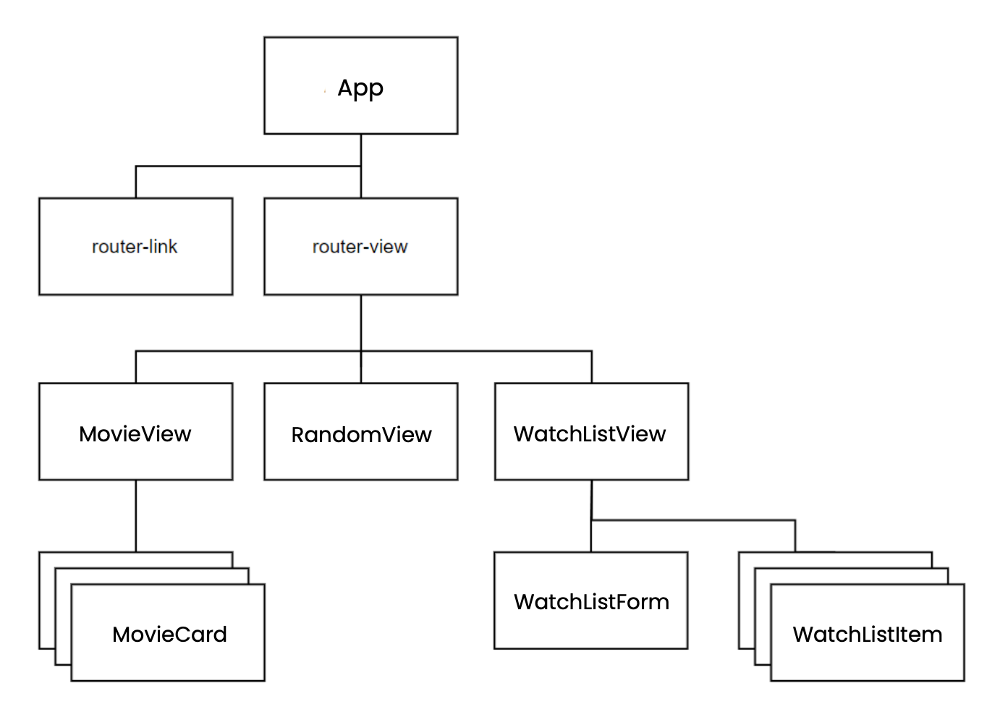
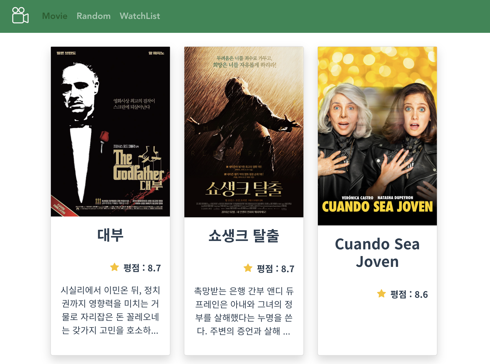
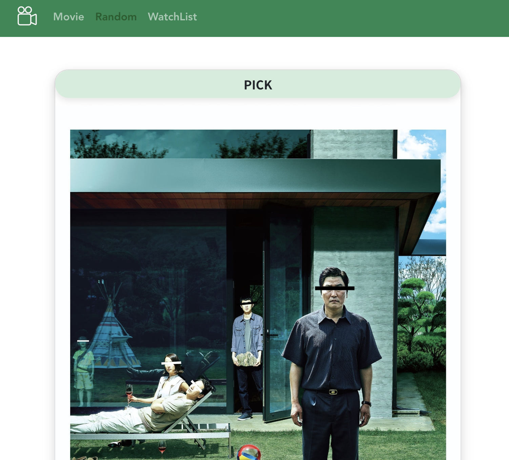
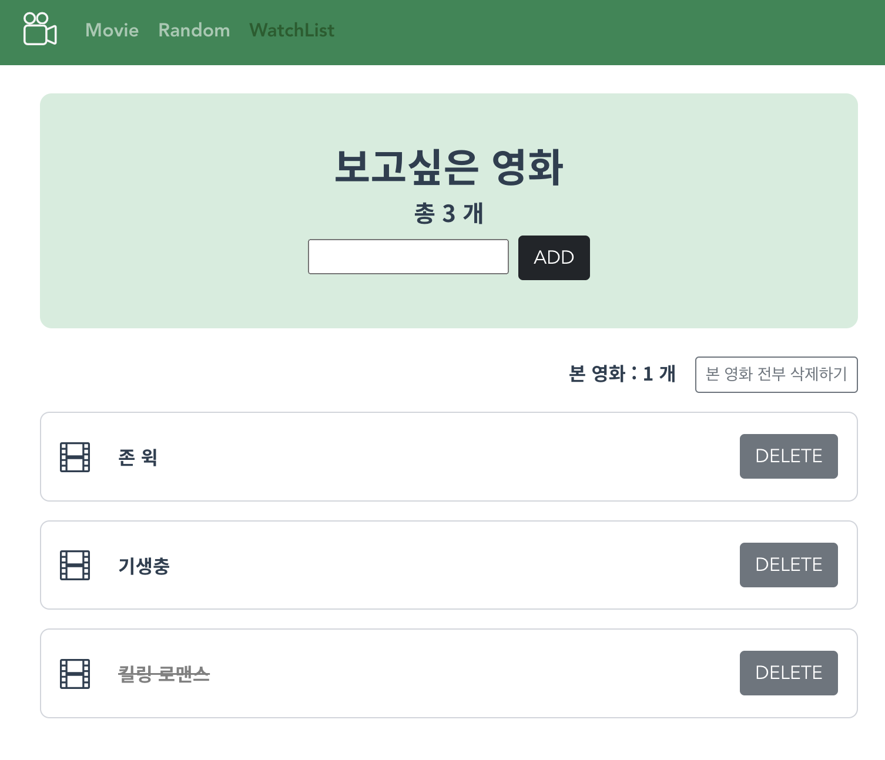

# 230512 관통프로젝트 09 - Vue를 활용한 SPA 구성
## 프로젝트 목표
- 영화 정보를 제공하는 SPA 제작
- AJAX 통신과 JSON 구조에 대한 이해
- Vue CLI, Vue Router 플러그인 활용
---
# 컴포넌트 구조

# App.vue - navbar

- `<router-link>`를 사용하여 라우터를 통해 페이지를 전환하는 네비게이션 바를 제작하였다.
- 반응형 디자인을 위해 부트스트랩을 이용하여 햄버거 버튼을 제작하고 화면 크기가 중간 이상일 때는 네비게이션 바가 확장되도록 하였다.
- `.nav-link.router-link-active` 클래스를 통해 현재 활성화된 라우터 링크는 더 진한 글씨로 보이도록 하였다.
  - navbar-dark 클래스 때문에 스타일 적용이 안되었었는데, `!important` 를 사용하여 스타일을 덮어쓰도록 하였더니 해결되었다.
# MovieView.vue
- 최고 평점 영화 20개를 출력하는 페이지를 작성하였다.

- 부트스트랩의 그리드 시스템을 사용하여 영화 카드를 표시하도록 하였다.
  - 반응형 디자인을 위해 부트스트랩을 활용하여 화면 크기가 클 때는 행당 3개, 작을 때는 1개씩 출력하도록 하였다.
- MovieCard 컴포넌트는 `v-for` 디렉티브를 사용하여 영화 배열의 각 항목마다 반복되도록 하였다.
- 영화 데이터를 가져올 때는 Vuex를 사용하였다.
  - created 훅에서 getMovies 메소드를 호출하여 Vuex(store)의 getMovies 액션을 실행하도록 하며,
  - computed 속성에서는 Vuex 스토어의 state에서 movies 배열을 가져와서 반환하도록 하였다.
## MovieCard.vue
- 부트스트랩의 그리드 시스템을 이용하여 카드를 배치하고, 카드 내부에는 영화 포스터, 제목, 평점, 줄거리를 담도록 하였다.
- `v-bind` 디렉티브를 사용하여 movie 객체를 MovieCard 컴포넌트에 전달하고, 이를 이용하여 카드 내부의 정보를 동적으로 렌더링하도록 하였다.
- .overview 클래스를 통해 줄거리를 보여줄 때 줄거리의 일부만 보여주도록 적용하였다.
# RandomView.vue
- 최고 평점 영화 중 랜덤 영화 한 개 출력하는 페이지를 작성하였다.

- 마찬가지로 데이터를 받아올 때 Vuex(Store)를 사용하려하였으나, 페이지에서 getters가 한번만 실행되기 때문에 pick 버튼 구현을 위해서 axios 요청을 따로 구현하였다.
  -  `axios`를 이용하여 themoviedb.org API를 호출하고,
  -  API에서 가져온 데이터를 randomIndex를 이용하여 랜덤으로 선택하도록 하였다.
# WatchListView.vue
- 보고 싶은 영화를 등록 및 삭제하는 페이지를 작성하였다.

- WatchListItem와 WatchListForm 컴포넌트로 작성한 보고 싶은 영화를 보여주고, 작성하는 부분을 구분하였다.
- created() 라이프 사이클 훅을 사용하여 로컬스토리지에 저장된 보고 싶은 영화를 불러오도록 하였다.
- Vuex(store)의 getters를 통해 보고 싶은 영화의 개수와 이미 본 영화의 개수를 count하도록 하였다.
- 이미 본 영화를 한번에 삭제할 수 있는 버튼도 구현하였다.
  - 이 버튼은 completed 된 영화를 필터링 한뒤 Vuex(store)의 deleteMovie 액션을 호출하여 영화를 삭제한다.
## WatchListForm.vue
- `v-model` directive를 사용하여 입력 필드와 component의 data를 양방향으로 연결하고, `@keyup.enter`, `@click` event listener를 사용하여 사용자가 Enter 키를 누르거나 ADD 버튼을 눌렀을 때 createMovie method를 실행하도록 하였다.
- `createMovie` method는 사용자가 입력한 데이터가 null 또는 undefined가 아닌 경우에만 새로운 영화를 생성하는 Vuex(store)의 action을 호출하도록 하였다.
  - 그렇지 않은 경우에는 사용자에게 영화 제목을 입력하도록 요청하는 alert를 표시하도록 하였다.
## WatchListItem.vue
- watchList의 단일 영화 아이템을 나타내는 컴포넌트를 작성하였다.
- Vuex(store)의 deleteMovie 액션을 호출하여 영화를 삭제할 수 있는 DELETE 버튼을 작성하였다.
- movie-item div 영역을 클릭하면 영화의 completed 속성이 토글 될 수 있도록 하였다.
  - 만약 completed 속성이 true라면 텍스트에 줄이 그어지고 색상은 회색으로 바뀌도록 하였다.