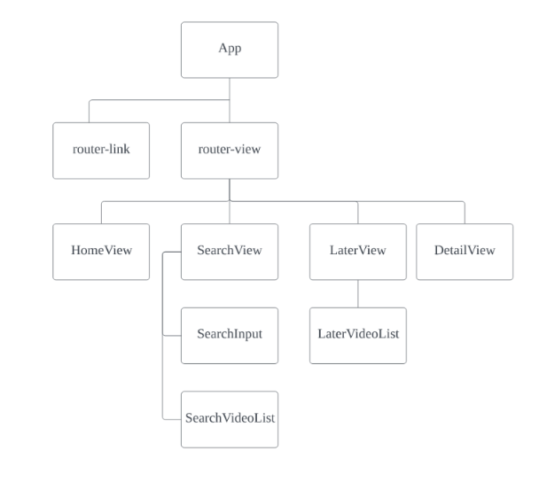

# Vue를 활용한 스트리밍 플랫폼 구현
## 프로젝트 요약
- Vue.js 를 활용한 스트리밍 플랫폼 구현
- 원하는 동영상을 Local Storage 에 저장하는 웹앱 제작
- 입력한 검색어에 해당하는 동영상 검색 결과 출력
## 프로젝트 목표
- YouTube API 를 활용한 스트리밍 플랫폼 구현
- AJAX 통신과 JSON 구조에 대한 이해
- Vue CLI, Vue Router, Vuex 플러그인 활용
---
# 컴포넌트 구조
